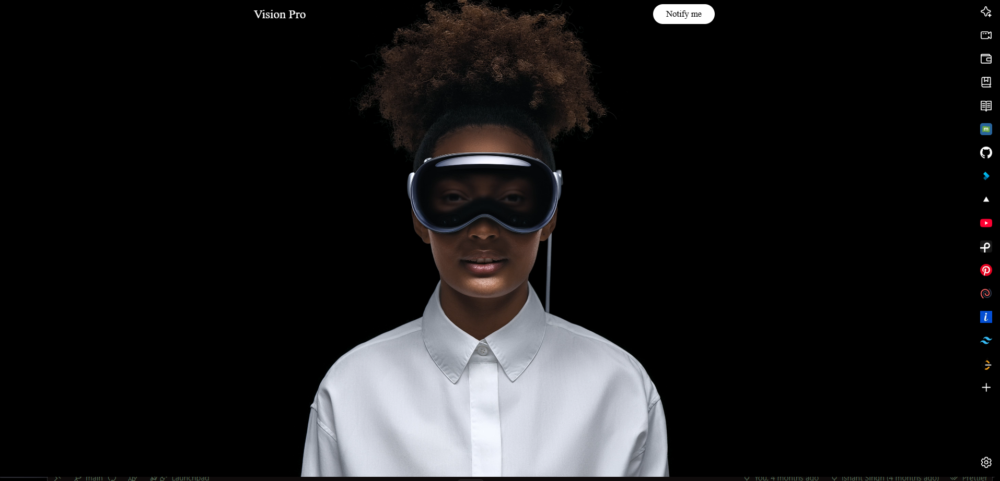
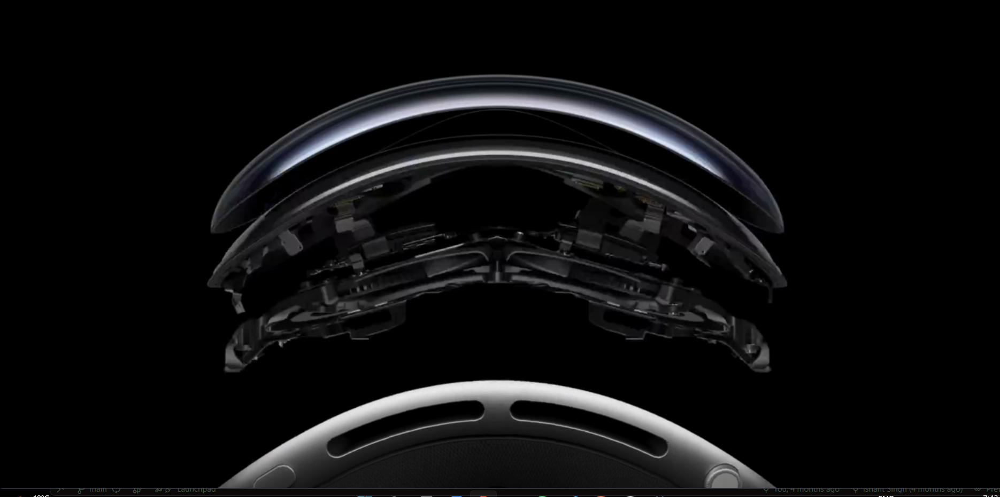
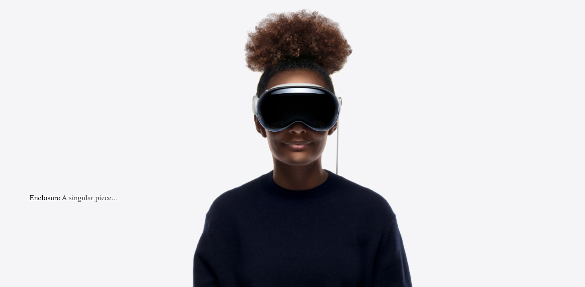

# Apple Vision Pro – Interactive Web Experience

A visually rich **Apple Vision Pro-inspired website** built using **HTML, CSS, GSAP, and Locomotive Scroll**.
This project recreates Apple-style smooth scrolling, scroll-triggered animations, and canvas-based image sequences to simulate immersive product storytelling.

The goal of this project was to practice **advanced front-end animation techniques and smooth user experience design**.

---

## 🚀 Live Experience : apple-vision-pro-psi.vercel.app

---

## ✨ Features

* Smooth scrolling using **Locomotive Scroll**
* Scroll-triggered animations using **GSAP ScrollTrigger**
* **Canvas image sequence animation** for 360° product view
* Multiple **video sections with autoplay**
* Apple-style **immersive storytelling layout**
* Responsive design for **desktop, tablet, and mobile**
* Smooth pinning and transitions while scrolling

---

## 🛠 Tech Stack

* **HTML5**
* **CSS3**
* **JavaScript**
* **GSAP (GreenSock Animation Platform)**
* **ScrollTrigger**
* **Locomotive Scroll**

---

## 🎬 Animations Implemented

### Scroll Controlled Video Playback

Videos start playing when the section enters the viewport.

### Canvas Frame Animation

A sequence of images renders on a canvas to simulate **360° product rotation**.

### Scroll Pinning

Sections stay fixed during animation using **GSAP pinning**.

### Smooth Scrolling

Locomotive Scroll provides **Apple-like smooth scroll behavior**.

---

## 📂 Project Structure

```
Apple-Vision-Pro-Clone
│
├── index.html
├── style.css
├── script.js
│
├── assets
│   ├── large.mp4
│   ├── large (1).mp4
│   ├── large (2).mp4
│   ├── apple-logo.png
│   ├── Apple vision image.png
│   ├── image-69.jpg
│   ├── image-70.jpg
│   ├── image-71.jpg
│   └── image-99.jpg
│
└── Fonts
    ├── SF-Pro-Display-Regular.otf
    └── SF-Pro-Display-Bold.otf
```

---

## 📸 Screenshots

## Screenshots









## ⚙️ Installation

Clone the repository

```
git clone https://github.com/yourusername/Apple-Vision-Pro.git
```

Open the project folder

```
cd Apple-Vision-Pro
```

Run the project

```
Open index.html in your browser
```

---

## 📚 What I Learned

Through this project I learned:

* Implementing **GSAP ScrollTrigger animations**
* Using **canvas for image sequence animations**
* Creating **smooth scrolling experiences**
* Structuring complex **scroll-driven UI interactions**
* Optimizing responsive layouts for multiple devices

---

## 🔮 Future Improvements

* Add **Three.js 3D models**
* Optimize animation performance
* Improve accessibility
* Add dark/light theme switch
* Convert to **React version**

---

## 👨‍💻 Author

**Ishant Singh**

Aspiring Full Stack Developer focused on building interactive web experiences.

GitHub:
https://github.com/Ishant8287
